# Taking a peek into the hidden layers

With deep learning emerging a game-changer in virtually all areas of science, a question that keeps on appearing is “How / what do neural networks learn?”.  Indeed, more and more people are now looking at new methods to visualize how individual neurons contribute to the overall prediction of neural nets, what is happening to the information content carried by the weights during training, what is the capacity and generalization capability and many more interesting questions regarding the “theory of deep learning”.  Some say the tools previously developed in the context of statistical physics may even come to the rescue…  Keeping track of this fast changing world is very challenging and it is easy to get lost while walking the fine line between hype, hardware / engineering advances, fancy new architectures and actual scientific insight…

One aspect that caught my attention is the so-called “manifold hypothesis” as mentioned in the (not so new but still awesome)    [blog post](http://colah.github.io/posts/2014-03-NN-Manifolds-Topology/) by Chris Olah.

According to this idea, “the task of a classification algorithm is fundamentally to separate a bunch of tangled manifolds”.

Looking for a simple synthetic dataset for myself in order to examine this idea in more concrete terms, I decided to follow and generalize the [spiral classification task](http://cs231n.github.io/neural-networks-case-study/) as introduced in one the CS231 lectures.  Similarly, for the sake of simplicity, I’m using a basic neural network consisting of 2 fully connected layers (the basic ANN).  The only “trick” is that the last hidden layer of my network has only 2 neurons.  Since the input is also in 2d, this means that I’ll be able to visualize how the data in the input space is being transformed at the in the hidden layer state in very straightforward way.

As an example I'm first showing what is happening in the case of 4 classes but the really interesting stuff comes from comparing plots for different number of classes.

## The input space:

The color of the points shows the class they belong to and the background color shows the class predicted by the neural net. 

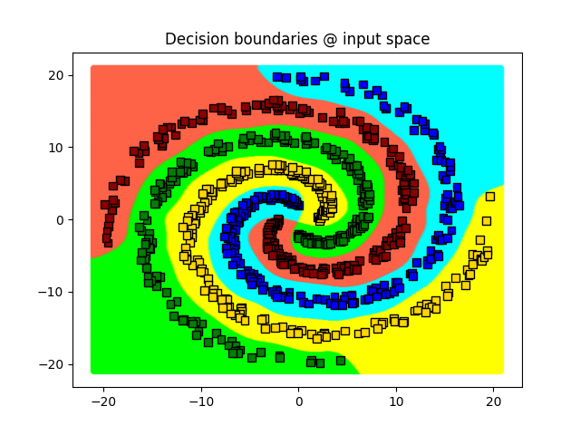

## Vector valued function from input to last hidden layer:

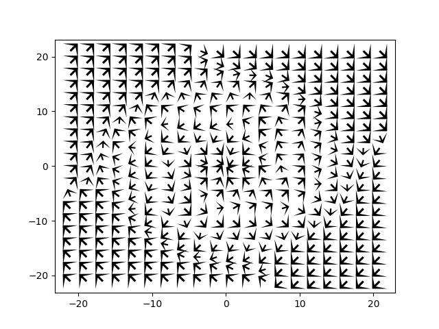
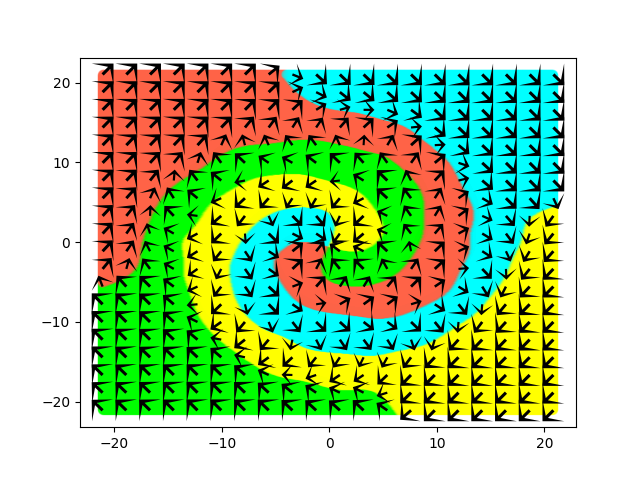

## Training and final decision boundaries

Since the very last activation function of the network is a “hyperbolic tangent”, all points from the input space are mapped into the square [-1, 1].  What is really interesting is that classes try to divide this space by grouping each other 

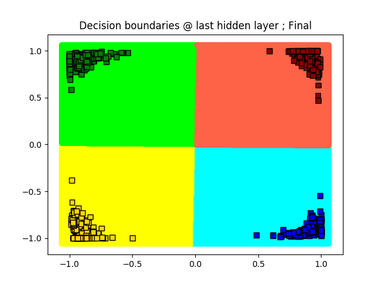

## Packing in the square

What I think (maybe I'm wrong) is the most interesting result of this little study.

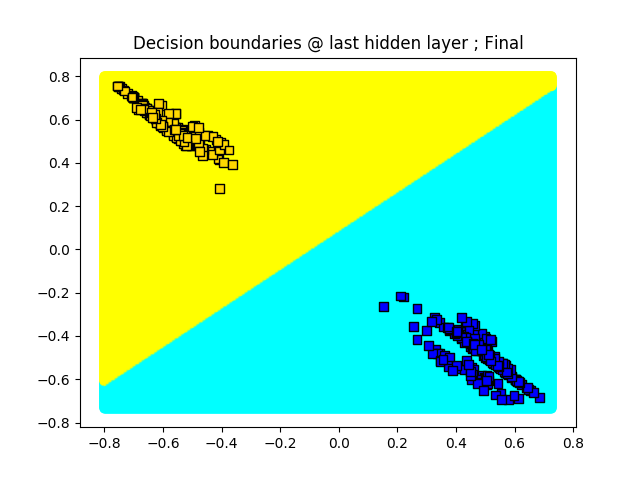
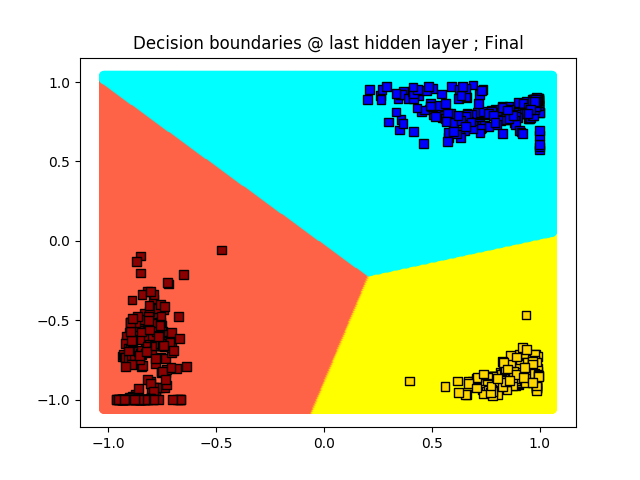

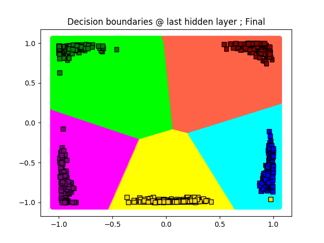
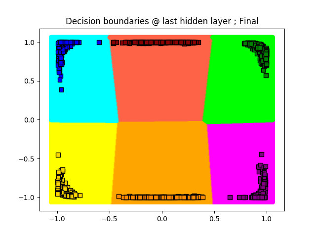
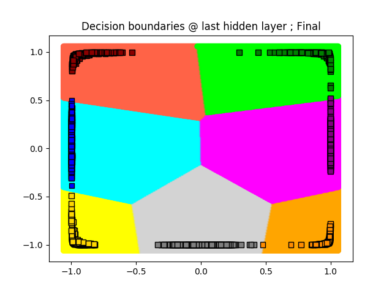

## Some interesting ideas to follow up:
1) as it’s becoming more clear why depth is actually important.  (HUJI) one may be tempted to replace the 1st hidden layer by more hidden layers with a smaller (ideally 2) number of neurons.
2) understand better the role of the length of the arrows in the vector plot.

In the spirit of keeping this a collaborative effort, I’d love to hear your ideas as well…

## And now, showing for different number of classes

Explain how to look at the packing problem in the square.

### 2 classes

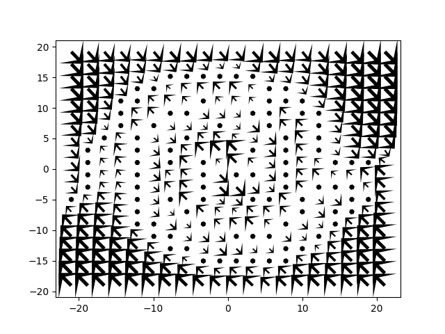
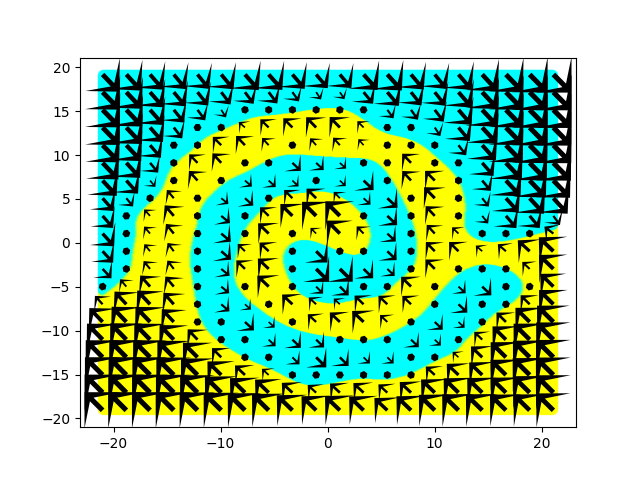

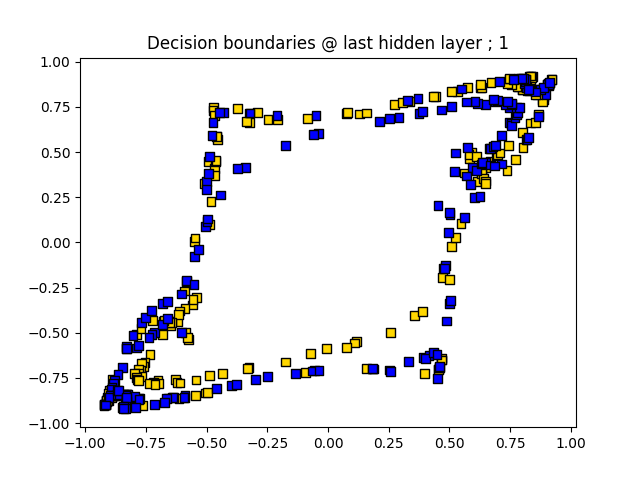

### 3 classes

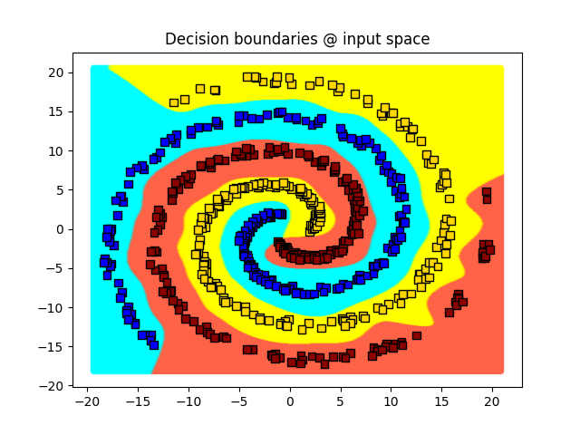

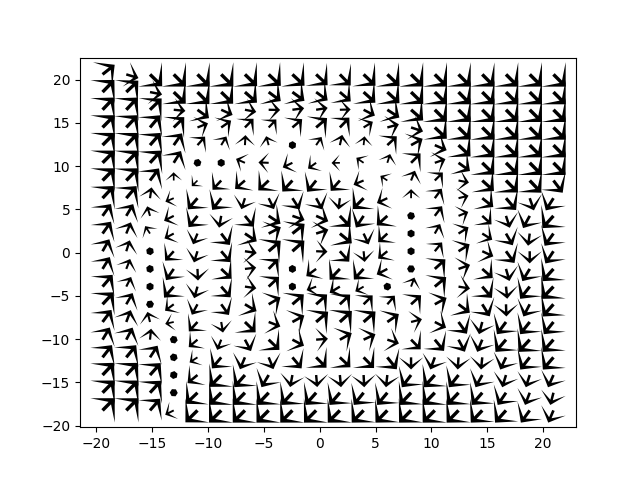
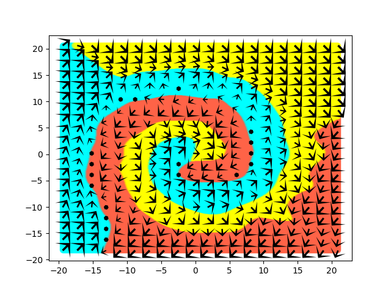

### 4 classes

### 5 classes

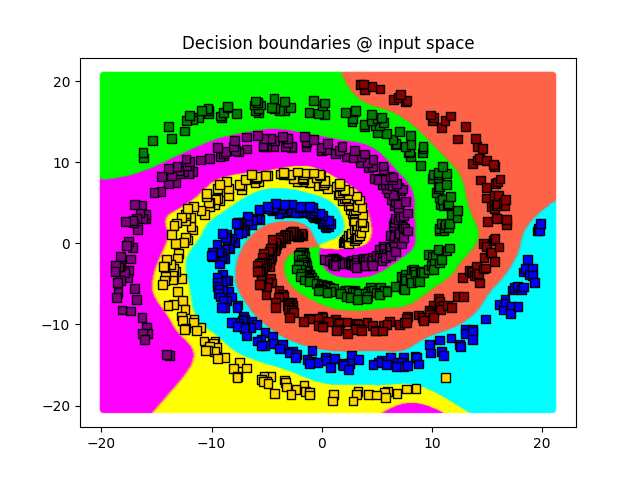

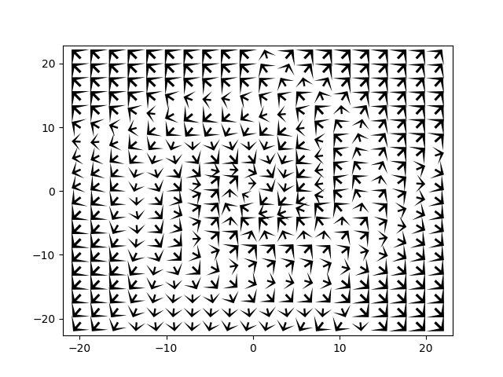
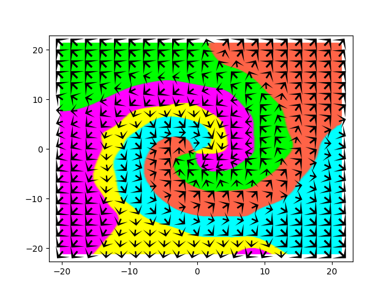

### 6 classes

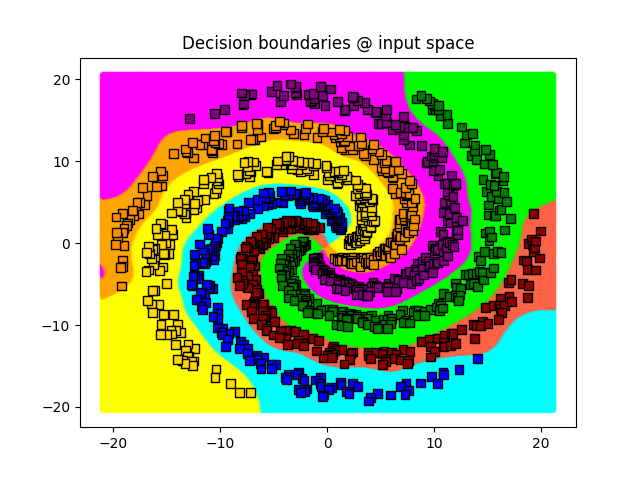

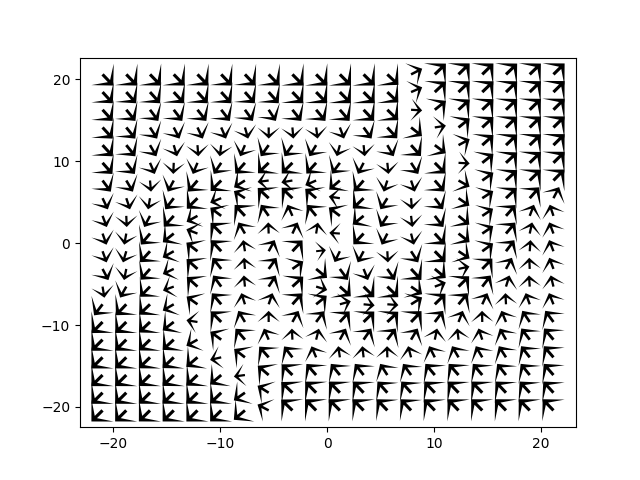
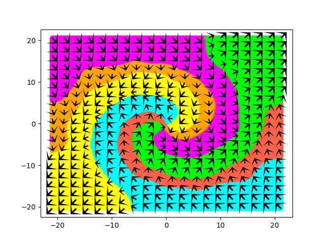

### 7 classes

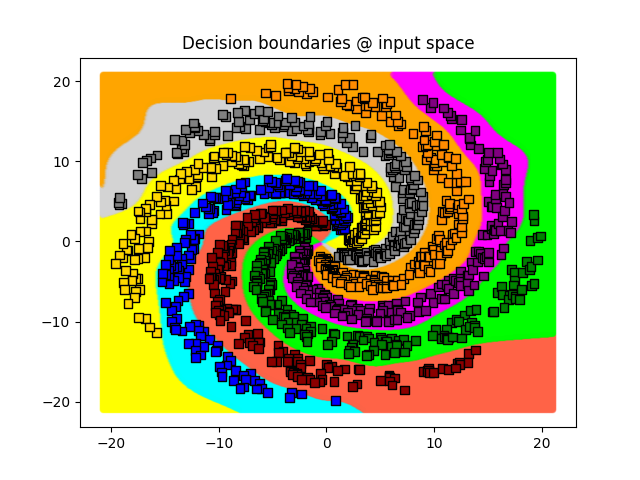

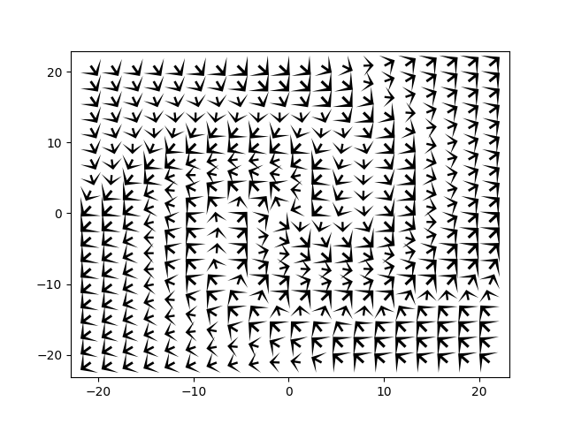
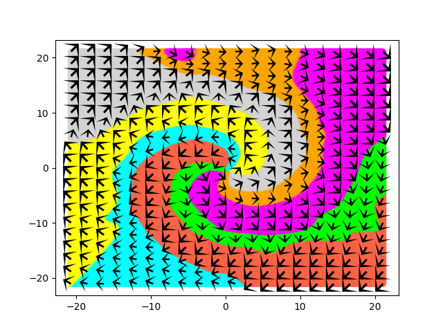

