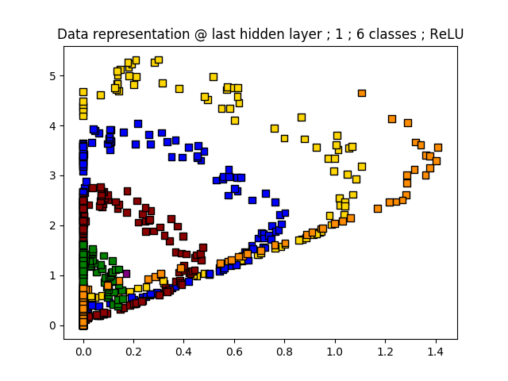

## Neural nets and optimal packing: taking a peek into the hidden layers...

With deep learning emerging a game-changer in virtually all areas of science, a question that keeps on appearing is: **"How & what do neural networks learn?"**

Despite a flurry of activity, the inner workings of these models work remain quite murky.  One interesting research direction is the so-called “manifold hypothesis” as mentioned by Chris Olah in an awesome [blog post](http://colah.github.io/posts/2014-03-NN-Manifolds-Topology/).  According to this idea, *"the task of a classification algorithm is fundamentally to separate a bunch of tangled manifolds"*.  Indeed, this geometrical approach sounds like a very natural interpretation.

Let's explore a little further by focusing on a very simple synthetic dataset of 2D interleaving spirals that belong to different classes.  The classification task can be achieved by a basic artificial neural network (MLP with 2 hidden layers). In addition, we are offering a side by side comparison of how the hyperbolic tangent (tanh) and rectified linear unit (ReLU) activation functions differ from each other during the training process.

The **trick** is that we architecture our network such that the last hidden layer has **only 2 neurons**.  Since the input is also in 2D, this means that we can visualize how the data flows from the input space to the last hidden in very straightforward way; it is a simple vector function **from R2 to R2**.

(*1st column*) The color of the points shows the class they belong to and the background color shows the class predicted by the trained neural net.

(*2nd column*) Final position of the data in the last hidden layer using tanh activation function. As expected the points are now **linearly separable** which explains the excellent accuracy demonstrated in the 1st column.

(*3rd column*) Evolution of dataset as it is bent during training in the last hidden layer using tanh activation function.  The interesting observation is that the points are **flowing to the most distant positions from each other as possible**.  Note that this "optimal packing" is conditional to the specific activation function.  For example, the hyperbolic tangent constrains the data to fit inside the **unit square** whereas the ReLU opens up a full **quadrant**. 

(4th & 5th columns) Same as 2nd & 3rd but with ReLU activation

  

## **Take home message**

The *separation of tangled manifolds* reveals itself as a function whose purpose is to bend the input data into clusters that **optimally pack in the space allowed for by the activation function** (unit square for tanh and quadrant for ReLU).

**Food for thoughts...**

- Could it be beneficial to design new activation functions that map into the unit sphere instead of a square / quadrant?  This way would ensure complete symmetry no matter what the number of classes is and avoid crowding effects...
- Is there sweet spot between crowding (as already hinted at here for more than 4 classes in 2D) and sparsity (exponential growth of number of corners with growing dimensionality of the layers)?  In other words, maybe this can be used to help architecture better networks...
- Depth gives an exponential growth of model expressivity, we could stack many 2-neuron layers together in order to see if how this optimal packing happens in other layers.  Alternatively, one can use dimensionality reduction techniques to do the same...
- Some additional plots relating to the properties of the bending function learned by the neural net are [stored](plotDir) in the repository.  Of particular interest are the vector plots representing the angles of the 2d -> 2d function from input to hidden space (look for *"plotDir/\*/tanh.vector.DataTransformer.png"* and *"plotDir/\*/tanh.angles.png"*).  The clear separation of angle distribution with respect to the class is further indication of the optimal packing idea mentioned above.

