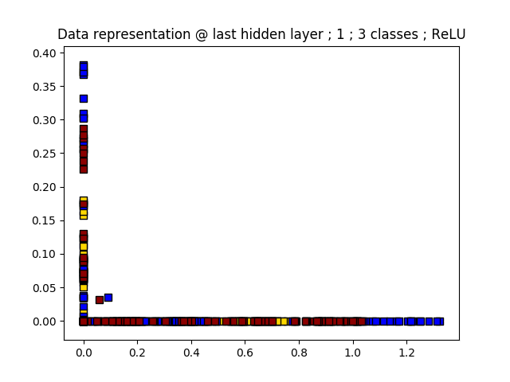

## Taking a peek into the hidden layers

With deep learning emerging a game-changer in virtually all areas of science, a question that keeps on appearing is: **"How & what do neural networks learn?"**

Despite a flurry of activity, the inner workings of these models work remain quite murky.  One interesting research direction is the so-called “manifold hypothesis” as mentioned by Chris Olah in an awesome [blog post](http://colah.github.io/posts/2014-03-NN-Manifolds-Topology/).  According to this idea, *"the task of a classification algorithm is fundamentally to separate a bunch of tangled manifolds"*.  Indeed, this geometrical approach sounds like a very natural interpretation.

Let's explore a little further by focusing on a very simple synthetic dataset of 2D interleaving spirals that belong to different classes.  The classification task can be achieved by a basic artificial neural network (MLP with 2 hidden layers).

The **trick** is that we architecture our network such that the last hidden layer has **only 2 neurons**.  Since the input is also in 2D, this means that we can visualize how the data flows from the input space to the last hidden in very straightforward way; it is a simple vector function **from R2 to R2**.

### A) Input space

The color of the points shows the class they belong to and the background color shows the class predicted by the trained neural net. 

### B) Training and final decision boundaries

(left) Evolution of where the input data is transformed to in the last hidden layer

(right) Final position of the data in the last hidden layer.  As expected the points are now linearly separable which explains why the final softmax logistic regression gives very good accuracy.  Another interesting observation is that the points are **flowing to the most distant positions from each other as possible**. 

#### What this looks like from input space

Now that we see where the points are taken to in the hidden layer, it may interesting to see this from the point of view of the input space. Since both input and the hidden data are in R2, it is possible to simply plot of the vector valued function that transforms the data from the input to its hidden representation.

(left) Without visual guide showing neural net predictions.

(right) Look how arrows point in a very specific direction within each class.  With 4 classes, arrows point to the corners of the unit square.

### C) Optimal packing on the edges of the unit square

As mentioned above points in the hidden layer are transformed such that they settle into the most distant positions from each other as possible.  This idea can be immediately checked by conducting the same analysis for a varying number of classes.

#### **Take home message**

The *separation of tangled manifolds* as mentioned in the introduction is carried out by finding a function bends the input data into clusters that optimally pack on the edge of the unit square in the hidden layer.  Hidden layer data first seeks to go into the corners and then starts to pile up on the edges while trying to keep a maximum separation from the other clusters.

#### **Food for thoughts...**

- Is there sweet spot between crowding (as already hinted at here for more than 4 classes in 2D) and sparsity (exponential growth of number of corners with growing dimensionality of the layers)?  In other words, maybe this can be used to help architecture better networks...
- Depth gives an exponential growth of model expressivity, we could stack many 2-neuron layers together in order to see if how this optimal packing happens in other layers.  Alternatively, one can use dimensionality reduction techniques to do the same...
- Could it be beneficial to design new activation functions that map into the unit sphere instead of a square?  This way would ensure complete symmetry no matter what the number of classes is...

### All the plots

##### 2 classes

##### 3 classes

##### 4 classes

##### 5 classes

##### 6 classes

##### 7 classes

